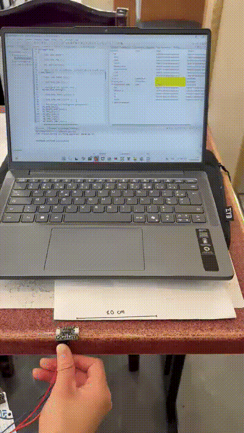
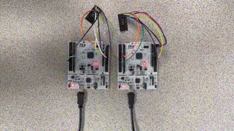

# 2526_projet1A_PCBot_G4
PCBot fait par le groupe de 4

## Rappels git

### Clé SSH

Dans git bash, lancez la commande suivante :

```bash
ssh-keygen
```

puis affichez la clé :

```bash
cat /c/Users/<USER>/.ssh/id_ed25519.pub
```

Créez une nouvelle clé dans github et collez la clé

### Clonez le projet

Pour récupérer le projet, à faire une fois (par projet).

```bash
git clone git@github.com:Harolove/2526_projet1A_PCBot_G4.git
```

### Faire un commit

A faire à chaque fois que quelque chose fonctionne, et après une séance de travail.

```bash
git status
git add .
git commit -m "Message"
git push
```

### Récupérer la dernière version

A faire à chaque fois qu'on commence à travailler

```bash
git pull
```
## Timeline
### 05/02/2026
Début du projet : Le professeur nous présente différents projets.
Nous avons choisi le PCBot car le projet nous paraît très intéressant même s'il en est un gros. Nous avons également utilisé cette séance pour découvrir git et github. Nous avons commencé les recherches des datasheets des différents composants du PCBot; et nous avons listé les différentes fonctionnalités de celui-ci.

### 12/02/2026
Draw.io :
- Schéma architectural

Kicad : 
- Début du schematic
- Modification des symboles déjà existants sur Kicad pour avoir des composants qui se rapprochent de ceux que nous allons utiliser

### 19/02/2026
Kicad :
- Création des feuilles hiérarchiques
- Continuation du schematic sur Kicad

### 12/03/2026
Kicad :
- Continuation du schematic sur Kicad

### 19/03/2026
Kicad : 
- Ajout de connexions inter-feuille
CubeIDE : 
- Début de code (détermination de position, calcul de distance avec obstacle, déplacement dans l'espace)

### 25/03/2026
Kicad :
- Début du routage (ajout des Mounting_Hole_Pad)
- Ajout des plans de masse (GND pour couches n°1, 2 et 4)

### 26/03/2026
CubeIDE :
- Modification du code et ajout de code test (car nous n'avons pas encore la carte)

### 09/04/2026
CubeIDE :
- Correction d'erreurs

### 16/04/2026
CubeIDE :
- Commentaire des différents fichiers .c et .h
- Recherche d'une librairie pour le capteur TOF

### 06/05/2026
Software : 
- Réussite à faire communiquer deux nRF24 avec deux Nucléos-L476RG

### 07/05/2026
Pratique :
- Soudure du PCB
Software :
- Test du code pour la centrale inertielle

### 13/05/2026
Pratique :
- Resoudure du PCB (car nous avons eu des problèmes la première fois)

### 15/05/2026
Software :
- Fonctionnement de la centrale inertielle

### 18/05/2026
Software :
- Test du code pour le capteur tof (mais n'a pas réussi à le faire fonctionner)
Onshape :
- Modélisation d'un support pour le PCB

### 19/05/2026
Onshape :
- Impression et assemblage du support


### Introduction:

Ce projet a pour objectif la conception d'un robot PCBot capable de connaître sa position dans l'espace et de se déplacer de manière autonome. Ce robot doit pouvoir cartographier un environnement en mesurant la distance qui le sépare des obstacles, et en communiquant avec d'autres PCBot, il peut reconstruire la carte d'un environnement beaucoup plus large.

### Choix des composants:

Nous avons choisi nos composants par rapport à trois critères: l'écologie, l'optimisation de l'espace et le coût.
- Pour la gestion de l'énergie, nous avons retenu le BMS BQ25896RTWR, qui accepte une large plage de tension d'entrée (3,9V à 14V) et offre un rendement supérieur à 90% à 3A, permettant l'utilisation d'adaptateurs standards (5V) ou haute tension (9V/12V).
- Pour le contrôle des moteurs DFR1224 à courant continu, nous avons opté pour le driver DRV8411APWPR pour sa compacité et sa simplicité d'utilisation, avec une large plage de fonctionnement de 1.65V à 11V.
- La localisation du robot repose sur la centrale inertielle LSM6DSOX, qui possède un accéléromètre et un gyroscope (que l'on n'utilisera pas dans le projet) dans un boîtier résistant aux chocs mécaniques.
- Pour la mesure de distance, nous avons choisi le capteur TOF VL53L0X pour ses bonnes performances en pleine lumière dans un encombrement réduit. 
- La communication sans fil entre robots est assurée par le module nRF24.

### Routage et conception du PCB:

Pour le routage, nous avons cherché à minimiser les distances entre composants interdépendants, en plaçant notamment les condensateurs de découplage au plus près des composants qu'ils protègent. Le PCB a été optimisé pour atteindre une taille minimale de 5,9 × 6,8 cm pour l'écologie.
Exemple: 


###

### Difficultés rencontrées:
Le soudage des composants a été l'étape la plus délicate du projet, marquée par plusieurs tentatives avant d'obtenir un résultat satisfaisant. Notre premier PCB a été un échec, car après le passage au four, nous avons remarqué que nous n’avons pas retiré la pâte à braser au niveau des trous du connecteur USB-C, rendant ainsi la carte inutilisable. Lors du deuxième essai, de la pâte à braser s’est retirée par inadvertance à certains endroits, compromettant là encore la qualité des soudures.
Sur notre PCB final, le passage au four a provoqué le déplacement de notre BMS et de certains condensateurs. De plus, une patte de la STM32 s’est pliée rompant ainsi le contact électrique avec plusieurs broches du microcontrôleur. Pour corriger ces problèmes, nous avons dû dessouder les composants concernés et les ressouder manuellement à l'air chaud avec du flux un liquide qui permet à l'étain de couler jusqu'aux pattes lors du chauffage à l'air chaud. Malgré ces difficultés, cette expérience nous a appris énormément sur les contraintes du soudage en production et sur les techniques de reprise manuelle. 

Après le soudage, nous avons tenté d'alimenter le PCB via un chargeur USB-C, mais les tensions mesurées au multimètre ne correspondaient pas aux valeurs attendues. Nous avons découvert que deux solder jumpers, JP1 et JP2, étaient ouverts par défaut, nous avons donc dû poser de l'étain dessus pour enfin avoir des alimentations correctes. Nous avons également constaté que le PCB ne fonctionnait qu'avec un chargeur USB-A, le chargeur USB-C ne semblant pas être reconnu correctement, sans que nous ayons pu en identifier la cause précise.

Du côté logiciel, nous n'avons pas réussi à établir la communication I2C avec le capteur TOF, que ce soit sur le PCB du projet ou avec notre STM32L476RG. Pourtant, la broche XSHUT a bien été mise à 1 dans le code, et l'alimentation du composant a été vérifiée avec un multimètre. 

### Modélisation 3D du support:
Nous avons conçu le support du robot sur OnShape. La principale contrainte de conception était d'assurer que les deux roues arrière et la bille aient la même hauteur pour garantir une surface de contact plane. Nous avons donc ajouté de la matière à l'avant du support afin de compenser la différence de hauteur.
Nous avons fait différents trous pour pouvoir faire rentrer les vis des moteurs et de la bille, et nous avons aussi fait le support pour le PCB. Cependant, l'impression n'a pas été parfaite et le support ne s'est pas emboîté correctement, pour pallier le problème, nous avons cassé l'un des picots du support afin que le PCB puisse tenir en place.


### IMU
Dans le cadre du projet, nous avons réalisé quelques tests avec le composant LSM6DSOX (Adafruit 4438), notre objectif était de pouvoir obtenir la distance parcourue par le composant à partir des données accélérométriques (par double intégration). Nous avons relié les lignes SDA et SCL de l’imu sur les broches PB6 et PB7 du microcontrôleur STM32L476RG.
Avant de faire ces tests, nous avons utilisé le registre WHO_AM_I du composant d’adresse 0x0F et qui contient 0x6C (108). Après lecture du contenu à cette adresse nous avons obtenu cette valeur, cela montre que le capteur est bien connecté.
Les registres OUTX et OUTY permettent de mesurer l'accélération selon l’axe x et l’axe y, cependant, dans le cadre de ces tests, nous allons plutôt nous concentrer sur un seul axe.
L'accélération est codée sur 16 bits au total, mais le bus I2C ne peut transférer que 8 bits à la fois. Donc le capteur découpe la valeur en deux morceaux de 8 bits et les range dans deux registres séparés :
- OUTX_L_A (0x28) contient les 8 bits de poids faible
- OUTX_H_A (0x29) contient les 8 bits de poids fort.


Le registre CTRL1_XL d’adresse 0x10 est le registre de configuration principal de l'accéléromètre. Il est composé de 8 bits répartis en trois parties :
- Les 4 bits de poids fort (ODR_XL3 à ODR_XL0) règlent la fréquence de mesure
- Les 2 bits suivants (FS1_XL, FS0_XL) règlent la plage de mesure
- Le bit LPF2_XL_EN active ou non un filtre passe-bas


Pour nos tests nous avons choisi d’envoyer 0x40 à ce registre qui correspond en binaire à 0100 0000, on a donc :
- 0100 pour ODR_XL qui correspond à 104 Hz dans le tableau pour un mode normal
- 00 pour FS_XL qui correspond à la plage ±2g (valeur par défaut)
- 00 pour le reste: filtre désactivé

On fixe la fréquence d'échantillonnage du capteur à 104 Hz, ce qui signifie qu'il prend 104 mesures par seconde, ce qui est largement suffisant pour nos tests, puisque dt = 0.02s correspond à une fréquence de 50 Hz dans le code. Le capteur mesure donc deux fois plus vite que notre boucle de calcul.
On fixe la plage à ±2g qui est adaptée pour nos tests car nos déplacements sont lents et à faible accélération.

L'approche que nous avons opté pour le code est d’implanter plusieurs variables volatiles:

- measurement_active: cette variable vaut 1 si la mesure est active et 0 sinon.
- pos_x: la position de x actuelle.
- x_pos_max: la position maximale de pox_x pendant une mesure, elle a été introduite car pos_x varie en continu et ne permet pas de lire directement une valeur stable.
  
Une mesure est lancée dès que l’on appuie sur le bouton poussoir PC13 et s’arrête lorsqu’on réappuie dessus pour nous donner la valeur de x_pos_max au cours de cette mesure. 

L'estimation de la position repose sur une double intégration temporelle. Cependant, cette intégration pose un problème de précision, de petites erreurs s'accumulent à chaque intégration et fausse le calcul de la position même quand le robot est immobile. Ainsi, pour limiter ces erreurs, nous avons mis en place 2 corrections:
- Les valeurs brutes du capteur sont converties en m/s² selon la plage de mesure ±2g.
- Si l'accélération est inférieure à 0,20 m/s², on la considère comme du bruit et on l'ignore.

  
Après implémentation de ce code, nous avons lancé le débogueur et regardé les valeurs de pos_x, x_pos_max et measurement_active dans Live Expressions de l'IDE, permettant d'observer en temps réel ces variables. 
Pour vérifier si notre code fonctionne, nous avons choisi de faire déplacer le capteur de 10 cm, après plusieurs essais, nous obtenons des résultats entre 9.1 et 10.5 cm, ce qui est plutôt satisfaisant.

Voici ce qu'on observe :




### nRF24:

Pour ce projet, nous avons besoin de faire communiquer deux robots distants.
Les capteurs LiDAR permettent une mesure précise, mais leur coût élevé et leur complexité de mise en œuvre (drivers, protocoles temps réel) dépassent les contraintes du projet. Nous avons donc opté pour une communication radio bas-coût avec le module nRF24L01+, qui offre une liaison sans fil simple à intégrer via SPI et suffisamment fiable pour nos besoins.
Nous avons relié deux modules nRF24L01+ à deux cartes Nucleo-L476RG et vérifié que les deux microcontrôleurs pouvaient s'échanger des messages de manière bidirectionnelle :



## Connexion matérielle:
Le nRF24L01+ communique via le bus SPI. Voici le câblage utilisé sur le STM32L476RG :
-	CE → PA8 (contrôle émission/réception)
-	CSN → PB6 (Chip Select SPI)
-	SCK → PA5 (SPI1_SCK)
-	MOSI → PA7 (SPI1_MOSI)
-	MISO → PA6 (SPI1_MISO)
-	VCC → 3.3 V  |  GND → GND

## Configuration du module:
Les principaux paramètres configurés dans nos tests :
-	Canal RF : canal 76, libre des perturbations Wi-Fi les plus courantes.
-	Débit : 1 Mbps — bon compromis portée/fiabilité pour notre usage.
-	Puissance d'émission : 0 dBm (niveau max), pour assurer la fiabilité en intérieur.
-	Taille de payload : 32 octets (mode statique).
-	Adresses : une adresse TX et une adresse RX configurées de façon symétrique sur les deux cartes.

La validation de la connexion SPI a été réalisée en lisant le registre CONFIG (adresse 0x00) : si la valeur retournée est cohérente (typiquement 0x08 après reset), le module est bien connecté et répond correctement.

## Approche logicielle:
Nous avons distingué deux rôles : un émetteur (TX) et un récepteur (RX), chacun configuré sur une Nucleo. Les fonctions principales sont :
-	nrf24_init() : initialise le SPI et configure les registres (canal, débit, adresses, taille payload).
-	nrf24_send(data, len) : place le module en mode TX, envoie le payload, attend l'acquittement (Auto-ACK).
-	nrf24_receive(buf) : place le module en mode RX, poll le registre STATUS pour détecter une donnée disponible, puis lit le FIFO.

Le bouton poussoir PC13 de la carte émettrice déclenche l'envoi d'un message. La carte réceptrice allume une LED (PA5) à chaque réception confirmée, permettant une vérification visuelle sans débogueur.

## Résultats:
Les tests montrent une communication stable entre les deux cartes.


### Conclusion:
À la fin du projet, nous avons réussi à faire communiquer deux nRF24 entre eux, la centrale inertielle a part et à faire fonctionner les 2 moteurs de roue, donc le robot peut se déplacer mais il ne peut pas encore s'arrêter librement ni changer de vitesse; les 2 LEDs fonctionnent, si D1 celà signifie que le PCB est alimenté et si D2 clignote c'est qu'il y a une erreur au niveau de la batterie (qui n'est pas connectée).
